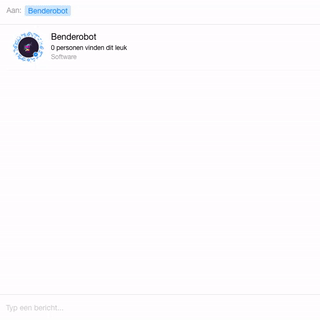
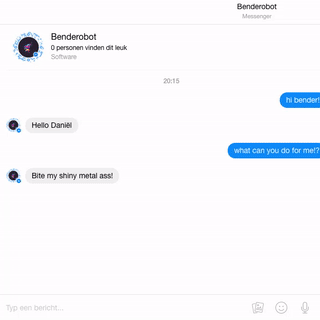

# benderobot
Bender the facebook messenger bot **[WIP]**.

[Retro Bender image attribution](https://dribbble.com/shots/2686048-I-Am-Retro-Bender)

## What can Bender do?
Bender can say hello:

Bender can fetch todays most popular posts from [Product Hunt](https://www.producthunt.com/):

_Note that you can't find Benderobot on facebook (yet), so
if you want to try it out, you need to run the API yourself
by following the instructions._

## Facebook quick start
The API is being built following the [quick start quide](https://developers.facebook.com/docs/messenger-platform/quickstart).

## Running the API
The API will run on port `8888` by default and can be run with
`npm run dev` (will restart the API on any change in the source code) or `npm start`.

## Environment variables
| Variable | Description | Required |
| --- | --- | --- |
| PORT  | Port the web server will be running on  | No |
| *VERIFY_TOKEN | Facebook webhook verification token used to ping the configured URL | Yes |
| *PAGE_ACCESS_TOKEN | Facebook page access token used to make authenticated requests using the [Send API](https://developers.facebook.com/docs/messenger-platform/send-api-reference) | Yes |

_* See the [facebook quick start quide](https://developers.facebook.com/docs/messenger-platform/quickstart) on how to obtain this token._

## Deployment
Recommend way to deploy is using heroku, following the [get started guide](https://devcenter.heroku.com/articles/getting-started-with-nodejs#introduction)

## Documentation
TODO
